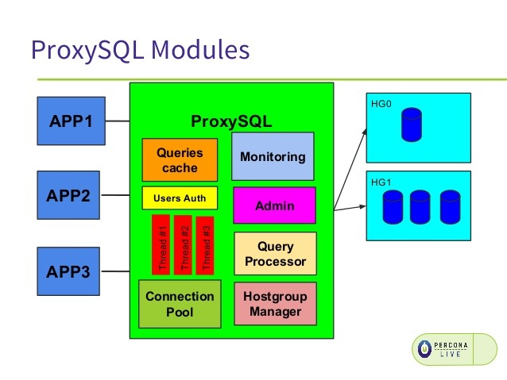

# ProxySQL

*ProxySQL provides a number of benefits:*

1. It provides ‘intelligent’ load balancing of application requests onto multiple databases
2. It understands the MySQL traffic that passes through it, and can split reads from writes. This is especially useful in a Master-Slave replication setup, when writes should only go to the master.
3. It understands the underlying database topology, whether the instances are up or down, and therefore can route requests to healthy databases
4. It shields applications from the complexity of the underlying database topology, as well as any changes to it
5. It provides query workload analytics, which is useful when analyzing and improving performance
6. It provides administrators with powerful control mechanisms to cache queries at the proxy layer for faster query response, re-route queries, or even re-write a badly written query
7. It empowers the administrator to maintain efficient operations of the overall infrastructure



## Setup ProxySQL in local workstation

*Make sure your local workstation installed docker, dokcer-compose*

1. Start services
```bash
cd /proxy-sql
sudo docker-compose up -d
```

2. Status
```bash
cd /proxy-sql
sudo docker-compose ps
```

3. Go to proxysql container
```bash
cd /proxy-sql
sudo docker-compose exec proxysql bash
```

4. Login to ProxySQL:

```bash
mysql -u admin -padmin -h 127.0.0.1 -P6032 --prompt='Admin> '

SHOW DATABASES;
```

## Configuration mysql replication

*Comming soon.*